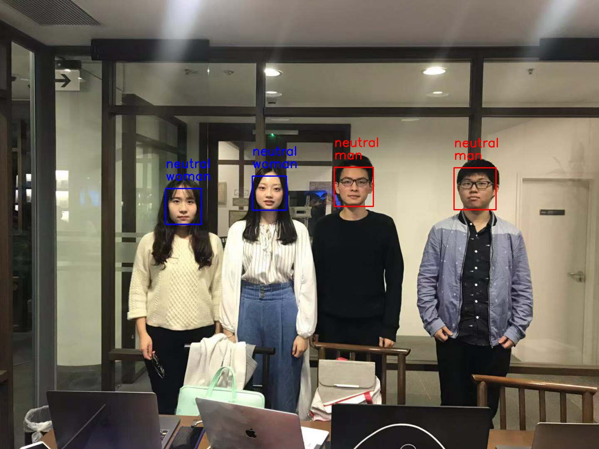
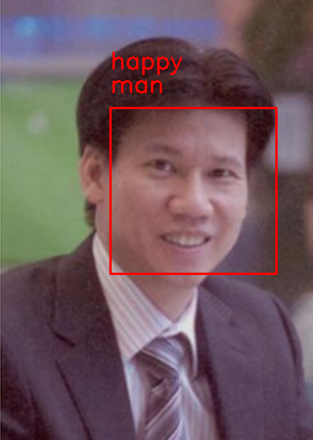

# about our project
## background
It is a project of my master class: Image Process. We focus on facial expression recognition and gender classification.
## the tools we used
- tensorflow
- keras
## model
- mini-XCEPTION (a framework of CNN)
## code
The main code is in the folder named src and there are three main file: two for training and one for using the model to recognize images.
## how to recognize
- to use our program, you have to install python and other packages.
```bash
pip install -r REQUIREMENTS.txt
```
- then you can use the following command to use
```bash
python3 image_emotion_gender_demo.py input_image output_image
```
input_image: the path of input image
output_image: the path of output image
example: python3 image_emotion_gender_demo.py ../images/professor.png ../images/professor_result.png

## how to train
 - datasets:

 1. [fer2013](https://www.kaggle.com/c/challenges-in-representation-learning-facial-expression-recognition-challenge/data) for emotion

 2. [imdb_crop](https://data.vision.ee.ethz.ch/cvl/rrothe/imdb-wiki/) for gender

 You should download the datasets and Untar them. Put them in the folder named datasets.
- then use the training file to train.
1. for emotion
    ```bash
    python3 train_emotion_classifier.py
    ```
2. for gender
    ```bash
    python3 train_gender_classifier.py
    ```
## some result examples





